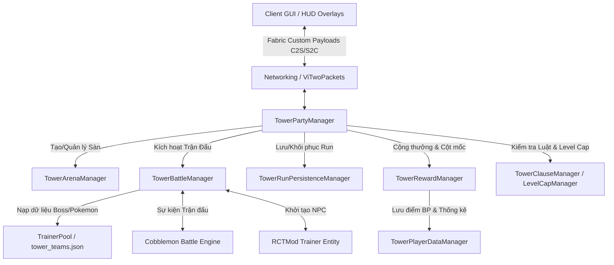
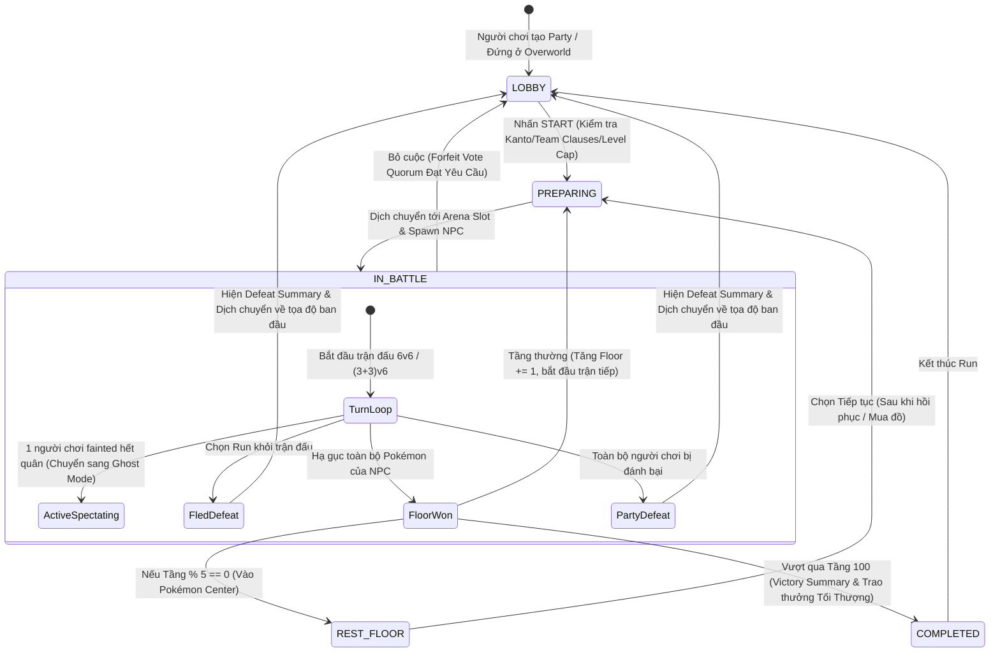
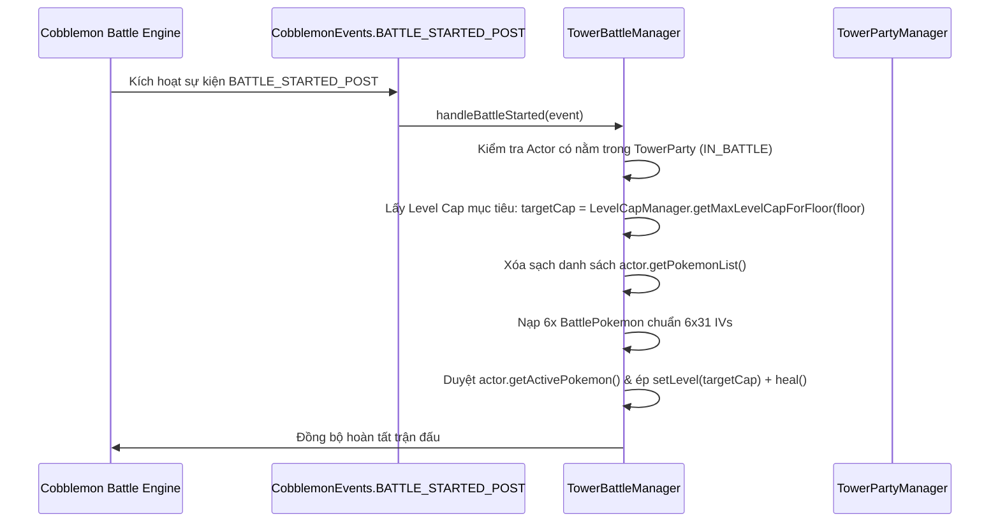
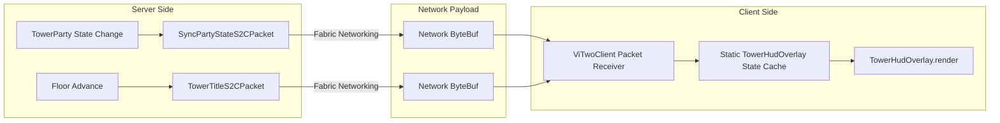

# 🏛️ COBBLE TOWER (ViTwo) - TÀI LIỆU THIẾT KẾ KIẾN TRÚC & THUẬT TOÁN HỆ THỐNG
## (System Architecture & Core Algorithms Specification)

> **Phiên bản:** v1.4.2  
> **Nền tảng:** Minecraft Fabric 1.21.1 (Java 21) | Cobblemon 1.5+ | RCTMod  
> **Mục đích tài liệu:** Quy chuẩn hóa toàn bộ kiến trúc hướng đối tượng (OOP Architecture), mô hình luồng dữ liệu (Dataflow), máy trạng thái (State Machine) và chi tiết các thuật toán lõi được sử dụng trong toàn bộ hệ thống CobbleTower.

---

## 📑 MỤC LỤC

1. [TỔNG QUAN HỆ THỐNG & PHÂN TẦNG KIẾN TRÚC](#1-tổng-quan-hệ-thống--phân-tầng-kiến-trúc)
2. [MÔ HÌNH VÒNG ĐỜI & MÁY TRẠNG THÁI (STATE MACHINE)](#2-mô-hình-vòng-đời--máy-trạng-thái-state-machine)
3. [CHI TIẾT CÁC THUẬT TOÁN LÕI (CORE ALGORITHMS)](#3-chi-tiết-các-thuật-toán-lõi-core-algorithms)
   - [3.1. Thuật toán Quản lý Không gian & Phân bổ Sàn đấu (Arena Pooling & Sector Allocation)](#31-thuật-toán-quản-lý-không-gian--phân-bổ-sàn-đấu-arena-pooling--sector-allocation)
   - [3.2. Thuật toán Quét Mặt Sàn An Toàn & Khử Ngạt Thở (Surface Clearance & Anti-Suffocation Search)](#32-thuật-toán-quét-mặt-sàn-an-toàn--khử-ngạt-thở-surface-clearance--anti-suffocation-search)
   - [3.3. Thuật toán Khởi Tạo Đội Hình Competitive & Chuẩn Hóa Chỉ Số (Competitive Team Loader & Stat Scaler)](#33-thuật-toán-khởi-tạo-đội-hình-competitive--chuẩn-hóa-chỉ-số-competitive-team-loader--stat-scaler)
   - [3.4. Thuật toán Can Thiệp Trận Đấu & Đồng Bộ Level Cap (Battle Lifecycle Interceptor)](#34-thuật-toán-can-thiệp-trận-đấu--đồng-bộ-level-cap-battle-lifecycle-interceptor)
   - [3.5. Thuật toán Lưu Trữ Bền Vững & Khôi Phục Tiến Trình Chơi (Run State Persistence & Re-Hydration)](#35-thuật-toán-lưu-trữ-bền-vững--khôi-phục-tiến-trình-chơi-run-state-persistence--re-hydration)
   - [3.6. Thuật toán Phân Bổ Hiệu Ứng Nguyền & Độ Khó (Procedural Floor Affix & Level Cap Mapping)](#36-thuật-toán-phân-bổ-hiệu-ứng-nguyền--độ-khó-procedural-floor-affix--level-cap-mapping)
   - [3.7. Thuật toán Kinh Tế Điểm Thưởng BP & Hệ Thống Danh Vọng (BP Economy, Milestones & Prestige Scaling)](#37-thuật-toán-kinh-tế-điểm-thưởng-bp--hệ-thống-danh-vọng-bp-economy-milestones--prestige-scaling)
   - [3.8. Thuật toán Hỗ Trợ Đồng Đội Ở Chế Độ Khán Giả (Ghost Support Recharge & Execution)](#38-thuật-toán-hỗ-trợ-đồng-đội-ở-chế-độ-khán-giả-ghost-support-recharge--execution)
   - [3.9. Giao Thức Mạng & Pipeline Đồng Bộ Giao Diện (Networking Protocol & HUD Pipeline)](#39-giao-thức-mạng--pipeline-đồng-bộ-giao-diện-networking-protocol--hud-pipeline)
4. [TỔNG KẾT & QUY TẮC MỞ RỘNG (EXTENSIBILITY GUIDELINES)](#4-tổng-kết--quy-tắc-mở-rộng-extensibility-guidelines)

---

## 1. TỔNG QUAN HỆ THỐNG & PHÂN TẦNG KIẾN TRÚC

Hệ thống CobbleTower được thiết kế theo mô hình **Phân tầng hướng dịch vụ độc lập (Decoupled Service-Layer Architecture)**. Mỗi Manager là một Singleton đảm nhiệm đúng một phạm vi nghiệp vụ duy nhất (Single Responsibility Principle).



### Bảng Trách Nhiệm Thành Phần:
| Manager / Lớp | File Nguồn | Trách Nhiệm Kỹ Thuật Chính |
| :--- | :--- | :--- |
| `TowerPartyManager` | [`TowerPartyManager.java`](file:///home/arjunsharma/Tài liệu/GitHub/ViTwo/src/main/java/com/vitwo/party/TowerPartyManager.java) | Điều phối luồng phiên chơi (Solo/Duo), quản lý máy trạng thái, giải quyết ngắt kết nối/kết nối lại, biểu quyết đầu hàng. |
| `TowerArenaManager` | [`TowerArenaManager.java`](file:///home/arjunsharma/Tài liệu/GitHub/ViTwo/src/main/java/com/vitwo/arena/TowerArenaManager.java) | Cấp phát vị trí trong Dimension riêng (`vitwo:tower_dimension`), tải NBT Structure, khử khối kỹ thuật, tính toán bề mặt an toàn. |
| `TowerBattleManager` | [`TowerBattleManager.java`](file:///home/arjunsharma/Tài liệu/GitHub/ViTwo/src/main/java/com/vitwo/battle/TowerBattleManager.java) | Can thiệp vào Observable Event Bus của Cobblemon (`BATTLE_STARTED_POST`, `BATTLE_VICTORY`, `BATTLE_FLED`), ép Level Cap, xử lý thắng/thua/chạy trốn. |
| `TowerRunPersistenceManager` | [`TowerRunPersistenceManager.java`](file:///home/arjunsharma/Tài liệu/GitHub/ViTwo/src/main/java/com/vitwo/party/TowerRunPersistenceManager.java) | Tuần tự hóa (Serialize/Deserialize) phiên chơi ra ổ cứng dạng JSON, đảm bảo không mất tiến trình khi máy chủ tắt hoặc người chơi thoát. |
| `TrainerPool` | [`TrainerPool.java`](file:///home/arjunsharma/Tài liệu/GitHub/ViTwo/src/main/java/com/vitwo/battle/TrainerPool.java) | Nạp dữ liệu Pokémon Competitive từ `tower_teams.json`, ánh xạ Trainer ID của RCTMod từ `rct_trainer_catalog.json`. |
| `TowerRewardManager` | [`TowerRewardManager.java`](file:///home/arjunsharma/Tài liệu/GitHub/ViTwo/src/main/java/com/vitwo/battle/TowerRewardManager.java) | Tính toán điểm Battle Points (BP), vật phẩm thưởng, kiểm tra thành tựu mốc tầng (Milestones), hồi phục tự động tại tầng Nghỉ. |
| `TowerPlayerDataManager` | [`TowerPlayerDataManager.java`](file:///home/arjunsharma/Tài liệu/GitHub/ViTwo/src/main/java/com/vitwo/party/TowerPlayerDataManager.java) | Lưu trữ vĩnh viễn dữ liệu người chơi: Checkpoint cá nhân, BP, lịch sử Run, danh hiệu, hào quang (Aura Cosmetics), cấp chuyển sinh (Prestige). |

---

## 2. MÔ HÌNH VÒNG ĐỜI & MÁY TRẠNG THÁI (STATE MACHINE)

Mỗi Party (`TowerParty`) hoạt động như một máy trạng thái hữu hạn (Deterministic Finite State Machine - FSM):



---

## 3. CHI TIẾT CÁC THUẬT TOÁN LÕI (CORE ALGORITHMS)

### 3.1. Thuật toán Quản lý Không gian & Phân bổ Sàn đấu (Arena Pooling & Sector Allocation)
- **Mục đích:** Đảm bảo hàng chục người chơi / party cùng leo tháp trong `vitwo:tower_dimension` cùng lúc mà không bao giờ bị trùng lặp vị trí, va chạm công trình, hoặc lag do liên tục sinh xóa chunk.
- **Lớp thực thi:** [`TowerArenaManager.java`](file:///home/arjunsharma/Tài liệu/GitHub/ViTwo/src/main/java/com/vitwo/arena/TowerArenaManager.java)

#### Giải thuật Cấp phát Khe Sàn Đấu (Slot Allocation):
Hệ thống sử dụng cơ chế **Slot Bitmask Pooling** quản lý tối đa 64 sàn đấu đồng thời:

$$\text{SectorX}(\text{slot}) = \text{slot} \times 300$$
$$\text{SectorZ}(\text{slot}) = 0$$

- **Cơ chế tái sử dụng cấu trúc (Structure Recycling):**
  - Khi một `slot` được cấp phát lần đầu, hệ thống tải trước toàn bộ các chunk trong hộp giới hạn $[X_1, Z_1] \to [X_2, Z_2]$ với kích thước $157 \times 135$ block.
  - Sau khi đặt cấu trúc `vitwo:tower_arena`, hệ thống thực hiện thuật toán **Khử Khối Kỹ Thuật (Technical Block Scrubbing)**: Quét toàn bộ thể tích $157 \times 77 \times 135$ để chuyển các khối `Blocks.JIGSAW`, `Blocks.STRUCTURE_BLOCK`, `Blocks.STRUCTURE_VOID` thành `Blocks.AIR`.
  - Khi party chuyển tầng ($F_x \to F_{x+1}$), công trình tại slot **được giữ nguyên**, chỉ xóa NPC Entity cũ và spawn NPC mới, giảm thiểu 99% chi phí I/O ghi đĩa.
  - Khi party rời tháp (Thắng/Thua/Forfeit), slot được giải phóng (`freeSlot(slot)`), sẵn sàng cho party tiếp theo.

```java
// Mã giả thuật toán cấp phát Slot
public synchronized int allocateSlot() {
    for (int i = 0; i < MAX_SLOTS; i++) {
        if (!allocatedSlots.contains(i)) {
            allocatedSlots.add(i);
            return i;
        }
    }
    return 0; // Fallback
}
```

---

### 3.2. Thuật toán Quét Mặt Sàn An Toàn & Khử Ngạt Thở (Surface Clearance & Anti-Suffocation Search)
- **Mục đích:** Tránh tuyệt đối việc người chơi hoặc NPC bị spawn lơ lửng trên không trung, rơi vào void, hoặc bị kẹt ngạt thở trong tường đá khi dịch chuyển vào tháp hay trở về thế giới thực.
- **Lớp thực thi:** [`TowerArenaManager.java`](file:///home/arjunsharma/Tài liệu/GitHub/ViTwo/src/main/java/com/vitwo/arena/TowerArenaManager.java)

#### 1. Quét bề mặt đứng an toàn (`findTopWalkableY`):
Quét từ trần $Y_{\max} = 115$ đi xuống đáy $Y_{\text{ground}} = 64$. Điều kiện để một tọa độ $Y$ được coi là mặt sàn hợp lệ:
1. Khối tại $(X, Y, Z)$ là khối rắn (`!state.isAir() && state.getBlock() != Blocks.BARRIER && state.getFluidState().isEmpty()`).
2. Khối tại $(X, Y+1, Z)$ và $(X, Y+2, Z)$ phải là khoảng không khí hoặc Barrier (`isAir() || isBarrier()`).

#### 2. Khử ngạt thở khi dịch chuyển về vị trí ban đầu (`returnPlayerToOriginalPos`):
Khi dịch chuyển về thế giới gốc (Overworld/Nether/Modded Dim), hệ thống kiểm tra hộp thể tích của người chơi (chân và đầu). Nếu bị nghẽn bởi khối rắn, thuật toán tự động dịch chuyển $Y$ lên phía trên tối đa 20 block cho đến khi tìm được 2 block không khí liên tiếp:

```java
BlockPos checkPos = new BlockPos((int) Math.floor(targetX), (int) Math.floor(targetY), (int) Math.floor(targetZ));
int searchCount = 0;
while (searchCount < 20 && targetY < targetWorld.getTopY()) {
    BlockState feet = targetWorld.getBlockState(checkPos);
    BlockState head = targetWorld.getBlockState(checkPos.up());
    if (feet.getCollisionShape(targetWorld, checkPos).isEmpty() && head.getCollisionShape(targetWorld, checkPos.up()).isEmpty()) {
        break; // Tọa độ an toàn, không có va chạm
    }
    targetY += 1.0;
    checkPos = checkPos.up();
    searchCount++;
}
```

---

### 3.3. Thuật toán Khởi Tạo Đội Hình Competitive & Chuẩn Hóa Chỉ Số (Competitive Team Loader & Stat Scaler)
- **Mục đích:** Xây dựng đội hình chuẩn Competitive (chuẩn Smogon VGC) gồm 6 Pokémon cho mọi NPC, với chỉ số Max $6 \times 31$ IVs, EVs, Nature, Ability, Moveset, Item tối ưu.
- **Lớp thực thi:** [`TrainerPool.java`](file:///home/arjunsharma/Tài liệu/GitHub/ViTwo/src/main/java/com/vitwo/battle/TrainerPool.java)

#### Cấu trúc Chuỗi Thuộc Tính Phân Tích (Property String Compilation):
Hệ thống sử dụng cú pháp DSL tích hợp của Cobblemon (`PokemonProperties.Companion.parse`) để khởi tạo Pokémon an toàn:

$$\text{DSL} = \text{species} + \text{ " level="} + C_{\text{floor}} + \text{ " ivs=31,31,31,31,31,31"} + \text{ [shiny]} + \text{ [nature]} + \text{ [ability]} + \text{ [item]} + \text{ [moves]}$$

#### Quy trình Xử lý Dữ liệu:
1. Nạp tệp JSON `tower_teams.json` vào bảng băm `Map<Integer, TowerTeam>`.
2. Chuẩn hóa tên định danh (Sanitize strings): xóa ký tự đặc biệt, chuyển dấu cách thành gạch dưới `_` (VD: `"Life Orb"` $\to$ `"life_orb"`, `"Dragon Dance"` $\to$ `"dragon_dance"`).
3. Nếu tầng không có trong file cấu hình, thuật toán chuyển sang cơ chế **Fallback Dynamic Pool**: tự động chọn các Pokémon thuộc nhóm OverUsed/Pseudo-Legendary tương ứng với độ cao của tầng.

---

### 3.4. Thuật toán Can Thiệp Trận Đấu & Đồng Bộ Level Cap (Battle Lifecycle Interceptor)
- **Mục đích:** Đảm bảo toàn bộ Pokémon của NPC luôn bằng đúng Max Level Cap của tầng hiện tại, ngăn chặn triệt để tình trạng NPC xuất quân sai cấp độ.
- **Lớp thực thi:** [`TowerBattleManager.java`](file:///home/arjunsharma/Tài liệu/GitHub/ViTwo/src/main/java/com/vitwo/battle/TowerBattleManager.java)



#### Xử lý Chạy Trốn (Flee/Run Handling):
Khi nhận sự kiện `BattleFledEvent`:
1. Giải mã UUID của người chơi thông qua Player Battle Actor.
2. Kiểm tra xem người chơi có thuộc một `TowerParty` đang `IN_BATTLE` hay không.
3. Nếu có: Lập tức gọi `onPartyDefeated(party, server)`, tính trận đấu là một trận Thất Bại, mở GUI Tổng Kết và dịch chuyển người chơi về vị trí ban đầu.

---

### 3.5. Thuật toán Lưu Trữ Bền Vững & Khôi Phục Tiến Trình Chơi (Run State Persistence & Re-Hydration)
- **Mục đích:** Cho phép người chơi thoát game giữa chừng, server khởi động lại hoặc ngắt kết nối mà vẫn giữ nguyên tiến trình leo tháp khi vào lại.
- **Lớp thực thi:** [`TowerRunPersistenceManager.java`](file:///home/arjunsharma/Tài liệu/GitHub/ViTwo/src/main/java/com/vitwo/party/TowerRunPersistenceManager.java)

#### Sơ đồ Tuần Tự Hóa (Persistence Schema):
Mỗi run được lưu trữ độc lập tại `cobbletower_data/runs/<UUID>.json`:

```json
{
  "playerA": "uuid-leader",
  "playerB": "uuid-member-or-null",
  "isSolo": true,
  "isTrueRun": true,
  "startFloor": 1,
  "currentFloor": 42,
  "bpEarned": 350,
  "totalTurns": 38,
  "totalFaints": 1,
  "mercyUsed": false,
  "startTimestamp": 1724217000000,
  "currentTrainerId": "cynthia",
  "currentBossName": "Champion Cynthia",
  "originalLeaderDim": "minecraft:overworld",
  "originalLeaderX": 102.5,
  "originalLeaderY": 70.0,
  "originalLeaderZ": -305.2,
  "originalLeaderYaw": 90.0,
  "originalLeaderPitch": 0.0
}
```

#### Thuật toán Tái Khôi Phục (Re-Hydration Protocol):
Khi người chơi tham gia server (`handleReconnect`):
1. Kiểm tra nếu người chơi đang ở trong chiều không gian `vitwo:tower_dimension` hoặc có tệp run đang hoạt động trong `TowerRunPersistenceManager`.
2. Nạp lại cấu trúc `TowerParty`, gán lại tọa độ gốc, Boss hiện tại, số lượt, số faints.
3. Đăng ký lại party vào bộ nhớ RAM (`registerRestoredParty`).
4. Gửi gói tin `SyncPartyStateS2CPacket` và mở lại HUD cho Client.

---

### 3.6. Thuật toán Phân Bổ Hiệu Ứng Nguyền & Độ Khó (Procedural Floor Affix & Level Cap Mapping)
- **Mục đích:** Tự động áp đặt giới hạn cấp độ và các hiệu ứng nguyền bất lợi (Affixes/Curses) để tạo độ thử thách tăng dần theo từng tầng.
- **Lớp thực thi:** [`LevelCapManager.java`](file:///home/arjunsharma/Tài liệu/GitHub/ViTwo/src/main/java/com/vitwo/battle/LevelCapManager.java), [`TowerCurseManager.java`](file:///home/arjunsharma/Tài liệu/GitHub/ViTwo/src/main/java/com/vitwo/battle/TowerCurseManager.java)

#### 1. Hàm Ánh Xạ Level Cap:
Cấp độ tối đa được tính toán theo bảng bước nhảy tiệm cận:

$$C_{\text{cap}}(F) = \begin{cases}
20 & \text{nếu } 1 \le F \le 10 \\
30 & \text{nếu } 11 \le F \le 20 \\
40 & \text{nếu } 21 \le F \le 30 \\
50 & \text{nếu } 31 \le F \le 40 \\
60 & \text{nếu } 41 \le F \le 50 \\
70 & \text{nếu } 51 \le F \le 60 \\
80 & \text{nếu } 61 \le F \le 70 \\
85 & \text{nếu } 71 \le F \le 80 \\
90 & \text{nếu } 81 \le F \le 90 \\
100 & \text{nếu } 91 \le F \le 100
\end{cases}$$

#### 2. Phân Bổ Luật Nguyền (Curses Distribution):
- **Tầng Boss (Chia hết cho 10):** Áp dụng nguyền cấp cao như *Perma-Weather (Bão cát vĩnh cửu, Mưa axit)*, *Entry Hazards*, hoặc *Stat Dampening*.
- **Tầng Thường:** Tính toán xoay vòng theo hàm băm `(floor * 31) % curseList.size()`.

---

### 3.7. Thuật toán Kinh Tế Điểm Thưởng BP & Hệ Thống Danh Vọng (BP Economy, Milestones & Prestige Scaling)
- **Mục đích:** Khen thưởng người chơi dựa trên thành tích leo tháp, mở khóa danh hiệu và vật phẩm đặc biệt.
- **Lớp thực thi:** [`TowerRewardManager.java`](file:///home/arjunsharma/Tài liệu/GitHub/ViTwo/src/main/java/com/vitwo/battle/TowerRewardManager.java), [`TowerPlayerDataManager.java`](file:///home/arjunsharma/Tài liệu/GitHub/ViTwo/src/main/java/com/vitwo/party/TowerPlayerDataManager.java)

#### Công thức Tính Điểm BP Mỗi Tầng:

$$\text{BP}(F) = \left( 10 + \lfloor F \times 0.5 \rfloor + \text{BossBonus}(F) \right) \times M_{\text{run}}$$

Trong đó:
- $\text{BossBonus}(F) = 50$ nếu $F \pmod{10} == 0$, ngược lại $= 0$.
- $M_{\text{run}} = 1.0$ (Nếu là **True Run** bắt đầu từ F1) hoặc $0.5$ (Nếu đi từ **Checkpoint**).

#### Hệ Thống Mốc Thưởng (Milestones):
Các mốc cố định: Tầng 10, 25, 50, 75, 90, 100. Mỗi mốc chỉ được nhận phần thưởng lớn một lần duy nhất trong toàn bộ tài khoản (Lưu dạng `Set<Integer> unlockedMilestones` trong file JSON người chơi).

---

### 3.8. Thuật toán Hỗ Trợ Đồng Đội Ở Chế Độ Khán Giả (Ghost Support Recharge & Execution)
- **Mục đích:** Cho phép người chơi bị thua sớm trong chế độ Co-op Duo (3+3) không bị nhàm chán, chuyển sang dạng "Hồn ma hỗ trợ" (Ghost Support) để buff cho đồng đội còn sống.
- **Lớp thực thi:** [`TowerParty.java`](file:///home/arjunsharma/Tài liệu/GitHub/ViTwo/src/main/java/com/vitwo/party/TowerParty.java), [`TowerPartyManager.java`](file:///home/arjunsharma/Tài liệu/GitHub/ViTwo/src/main/java/com/vitwo/party/TowerPartyManager.java)

#### Quy trình Tích Lũy Điểm Năng Lượng (Energy Recharge):
- Điểm Ghost Energy tối đa: 2 điểm.
- Sau mỗi 3 lượt đánh của đồng đội ($\Delta T \ge 3$), hệ thống hồi 1 điểm sạc (`ghostSupportCharges += 1`).
- Người chơi khán giả có thể kích hoạt 3 loại kỹ năng:
  1. **Ghost Cheer (Cổ vũ):** Hồi phục 25% HP cho Pokémon đang xuất chiến của đồng đội.
  2. **Ghost Hex (Ám khí):** Tăng 1 bậc Attack / Special Attack cho Pokémon của đồng đội.
  3. **Ghost Purify (Thanh tẩy):** Xóa toàn bộ hiệu ứng trạng thái bất lợi (Burn, Poison, Paralysis, Sleep, Freeze).

---

### 3.9. Giao Thức Mạng & Pipeline Đồng Bộ Giao Diện (Networking Protocol & HUD Pipeline)
- **Mục đích:** Giao tiếp Client-Server hai chiều phi đồng bộ, đảm bảo HUD luôn cập nhật tức thời mà không gây tụt FPS của Client.
- **Lớp thực thi:** [`ViTwoPackets.java`](file:///home/arjunsharma/Tài liệu/GitHub/ViTwo/src/main/java/com/vitwo/network/ViTwoPackets.java), [`TowerHudOverlay.java`](file:///home/arjunsharma/Tài liệu/GitHub/ViTwo/src/main/java/com/vitwo/client/hud/TowerHudOverlay.java)



#### Quy chuẩn Render Nút Bấm & Khung Viền UI (3D Minecraft Aesthetics):
- **Khung Viền Kép (Double Bevel Border):**
  - Viền ngoài: Màu Cyan rực rỡ `0xFF00E5FF` (Độ dày 1px).
  - Viền trong: Màu Cyan đậm `0xFF00838F` (Độ dày 1px).
  - Nền bảng: Đá phiến sẫm nguyên khối `0xF610151C` (Độ mờ 96%).
- **Nút Bấm (`TowerButton`):** Kế thừa trực tiếp `ButtonWidget` và gọi `super.renderWidget` để giữ nguyên 100% texture nổi khối 3D nguyên bản của Minecraft Settings UI.

---

## 4. TỔNG KẾT & QUY TẮC MỞ RỘNG (EXTENSIBILITY GUIDELINES)

Khi phát triển thêm các tính năng mới trong tương lai, lập trình viên bắt buộc phải tuân theo các nguyên tắc kiến trúc sau:

1. **Tính Bất Biến Của Dữ Liệu Tầng:** Không bao giờ gọi hàm random ngẫu nhiên trong các hàm render hoặc đồng bộ mạng. Luôn lấy Trainer ID và Boss Name thông qua `party.getCurrentBossName()` đã được chốt tại đầu tầng.
2. **Nguyên Tắc Xử Lý Chunk:** Bất kỳ thao tác spawn Entity hoặc đặt NBT Structure nào cũng phải đi kèm lệnh nạp chunk trước (`world.getChunk(x >> 4, z >> 4)`).
3. **An Toàn Luồng Máy Chủ:** Mọi can thiệp vào Player Entity hoặc Game State từ các Event Listener bất đồng bộ phải được bọc trong `server.execute(() -> { ... })`.
4. **Chuẩn Hóa Đội Hình:** Đội hình NPC luôn được can thiệp tại `BATTLE_STARTED_POST` và phải ép cấp cả đội hình dự bị lẫn `ActiveBattlePokemon`.

---
*Tài liệu này được lưu trữ và cập nhật tự động trong hệ thống mã nguồn CobbleTower (ViTwo).*
